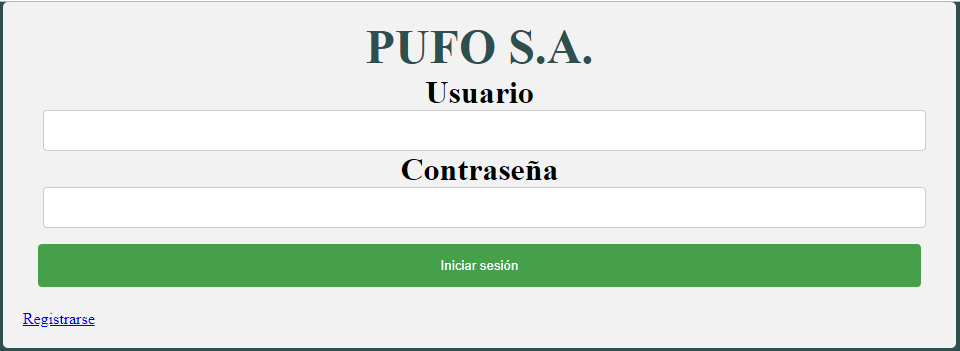
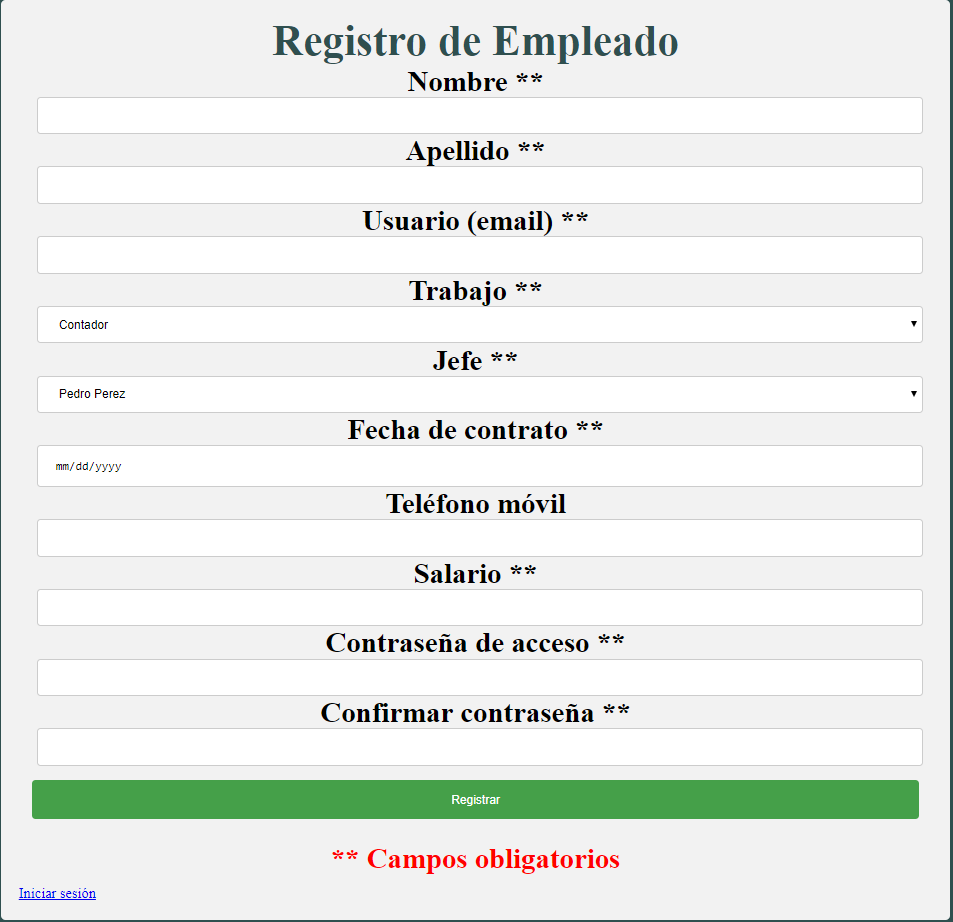
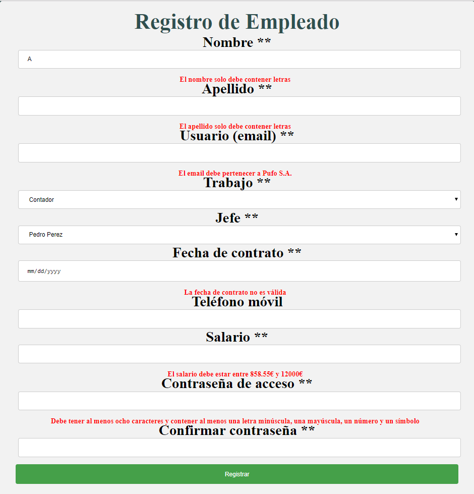
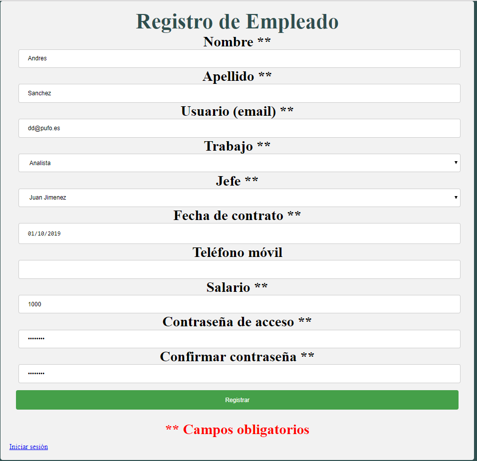
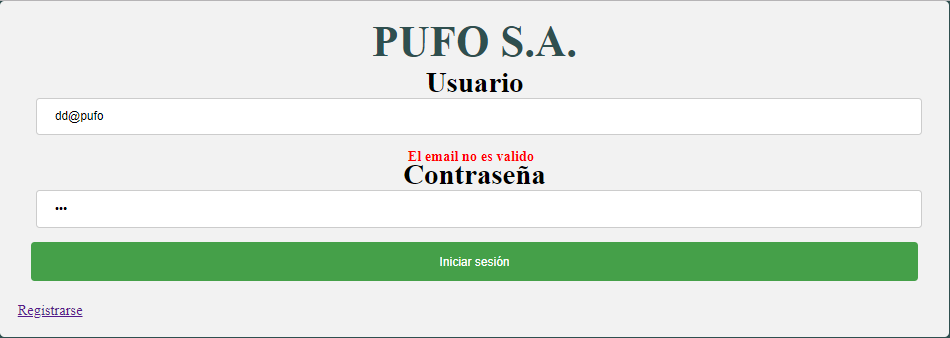
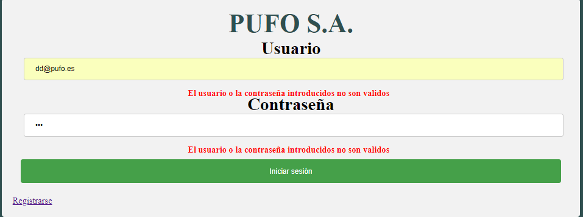
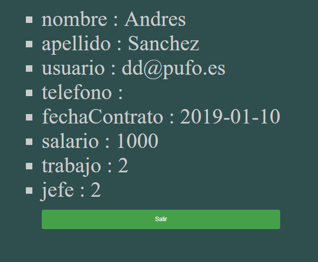

# Formulario para Pufo S.A.

## USO

La página principal contiene un formulario para hacer login y un enlace a la página de registro:

Para registrar un usuario tendremos el siguiente formulario:

En el formulario se indican los campos obligatorios y se hace una validación mediante evento 'keyup' en los input de tipo texto y de 'change' en el caso del de fecha.

Se indica en todos los campos el valor esperado:

Una vez rellenado el formulario correctamente habrán desaparecido todos los mensajes de error:

Nos redirigirá al login, en este formulario también hay una validación de que el mail pertenezca a pufosa:

En el caso de que el usuario o la contraseña no sean válidos se indicará en ambos campos:

Finalmente si el usuario y contraseña son válidos se creará la sesión y nos mostrará los datos del usuario:

Hay un botón salir que cerrará la sesión y nos permitirá registrar o logar con otro usuario.

## Implementación

### Validación
La validación de los formularios se ha implementado en su mayoría a través de regex, en el caso de la validación del salario se emplea una función que verifica la cantidad introducida, y en el caso de la fecha se emplea una validación con el objeto Date.

### Cookies
Para las cookies se ha empleado 2 funciones, una que crea las cookies pasándole como parámetro el nombre, valor y días de duración y otra que lee y devuelve valor de la cookie indicada.

### Registro
Cuando se registra un usuario se crea un objeto de propiedades con cada uno de los campos introducidos y se transforma en String para guardarlo en una cookie cuyo nombre será el email del empleado.

### Sesión
La sesión se gestiona a través de una cookies llamada 'session' que contiene como valor el email del usuario.